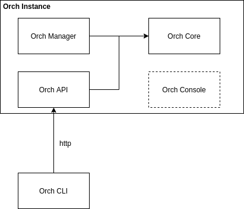
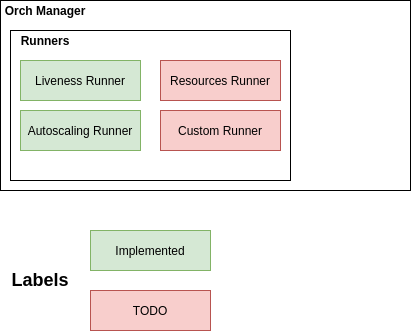
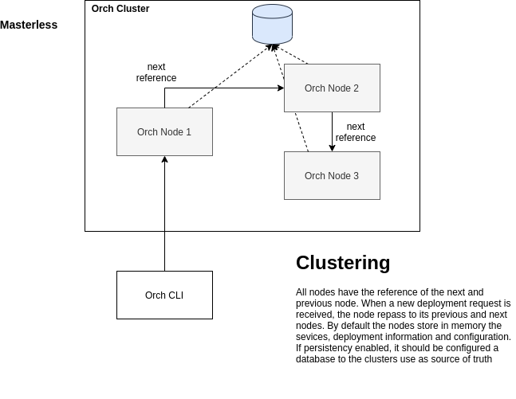

# orch
A lightweight container orchestrator, simple to set up and use.

To install, just type:

    pip3 install .

Start the orch api typing:
    python3 src/api.py

To run, type:
    orch --help

